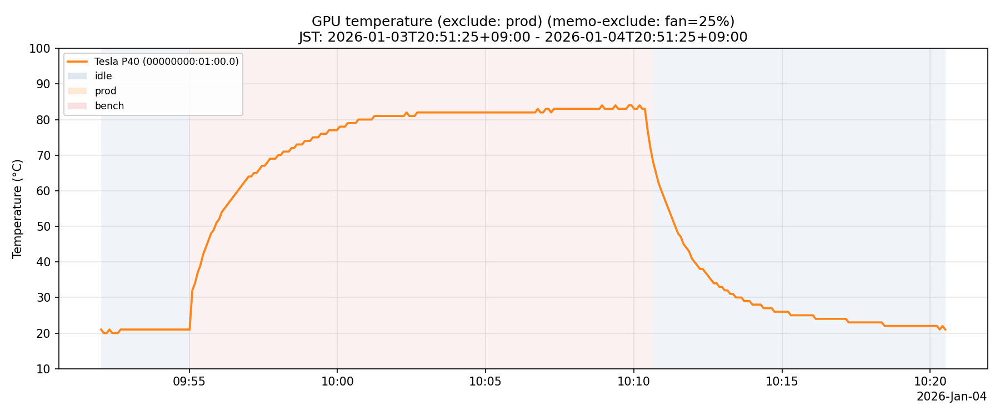
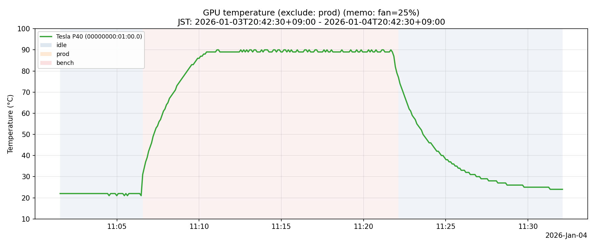
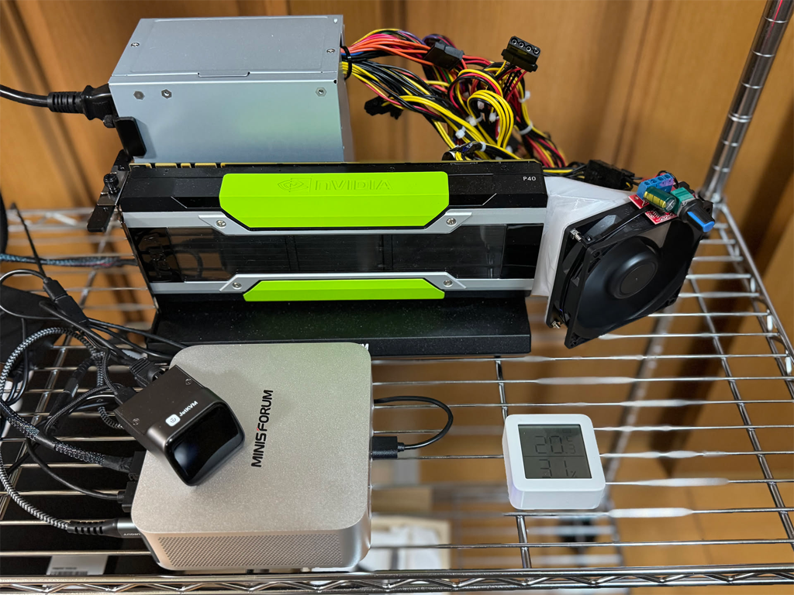
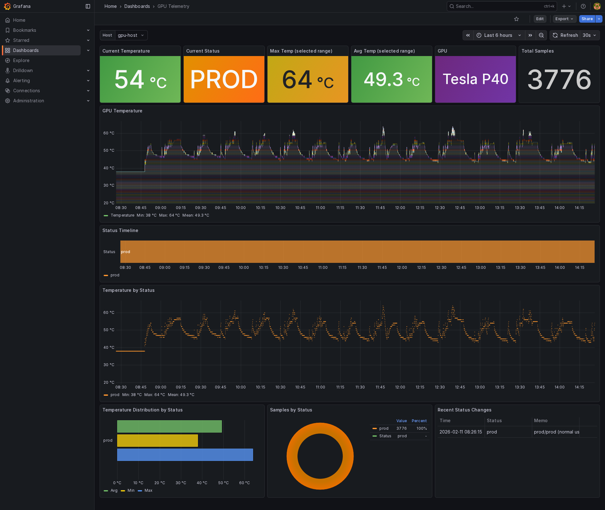

# gpu-telemetry

GPU telemetry collector and helper scripts.

## Readme

- English: `README.en.md`
- 日本語: `README.ja.md`

## Docs

- English: `docs/operations.en.md`
- 日本語: `docs/operations.ja.md`

P40 bring-up (until `nvidia-smi` works; Ubuntu 22.04):

- English: `docs/p40-nvidia-smi.ubuntu22.en.md`
- 日本語: `docs/p40-nvidia-smi.ubuntu22.ja.md`

## Images

### Temperature plot

Fan 100% (baseline):



Fan 25%:



Generate/update the plot:

```bash
uv sync

# fan 100% (baseline)
uv run ./bin/plot_temp.py --hours 24 --exclude-prod \
  --include-memo "fan=100%" \
  --out docs/images/gpu-temp-fan100.png

# fan 25%
uv run ./bin/plot_temp.py --hours 24 --exclude-prod \
  --include-memo "fan=25%" \
  --out docs/images/gpu-temp-fan25.png
```

### Setup



### Grafana dashboard


