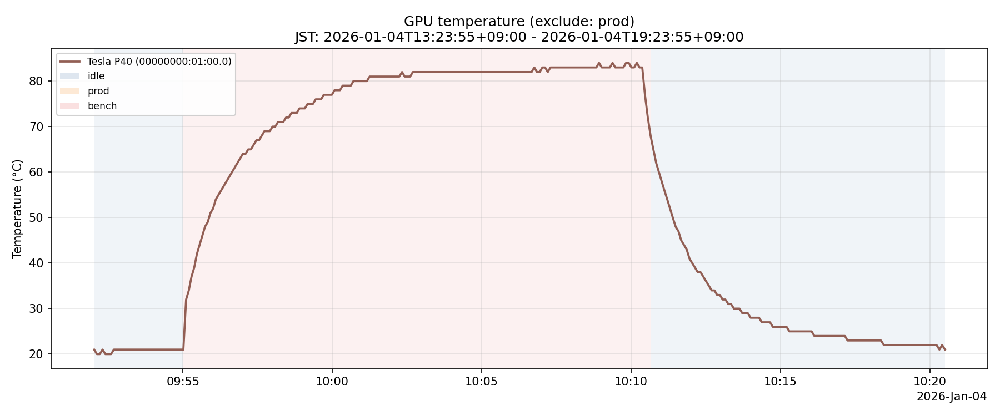

# gpu-telemetry

GPU telemetry collector and helper scripts.

## Readme

- English: `README.en.md`
- 日本語: `README.ja.md`

## Docs

- English: `docs/operations.en.md`
- 日本語: `docs/operations.ja.md`

## Images

### Temperature plot



Generate/update the plot:

```bash
uv sync
uv run ./bin/plot_temp.py --hours 24
```

Exclude `prod` rows (e.g., focus on benchmark / non-prod ranges):

```bash
uv run ./bin/plot_temp.py --hours 24 --exclude-prod
```

### Setup


