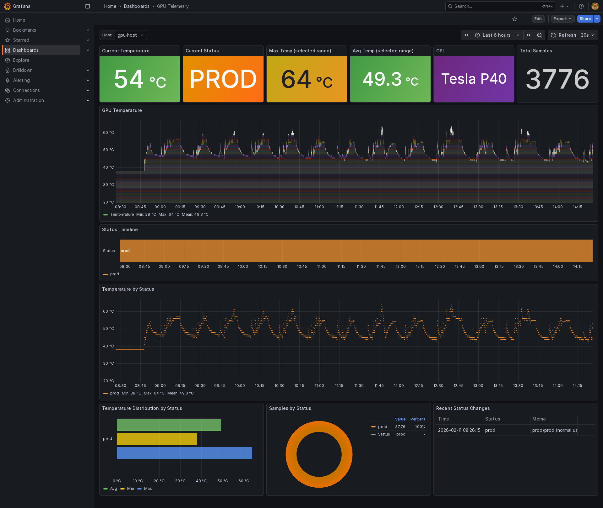

# Operations (Runbook for X1 AI + DEG1 eGPU + Tesla P40 Temperature Monitoring)

This document is a zero-based runbook for collecting GPU telemetry (focused on temperature) on a Minisforum X1 AI with a Tesla P40 connected via a DEG1 eGPU dock.

## Goal

- `nvidia-smi` can see the GPU
- Telemetry is continuously inserted into PostgreSQL (spool to `spool/` when DB is down; flush after recovery)
- Run `gpu-burn` and confirm temperature increase is recorded in DB

Note:

- This runbook assumes telemetry collection is already running continuously (e.g. via `systemd --user` units like `gpu-telemetry.service` and `gpu-telemetry-flush.timer`). Benchmark scripts primarily update `status.json` (`status_tag`/`status_memo`) so you can filter telemetry later.

## Hardware (BOM)

- **Host**: Minisforum X1 AI
- **eGPU dock**: DEG1 eGPU
- **GPU**: NVIDIA Tesla P40 × 2 (`01:00.0` / `07:00.0`)
- **PSU**: Kuroutoshikou 600W ATX PSU

Reference prices (as of Dec 2025):

- Nvidia Tesla P40 24GB (used) ¥30,345-
- Minisforum X1 AI 32GB/1TB SSD ¥107,993-
- Minisforum DEG1 eGPU Dock ¥11,381-
- 600W ATX PSU ¥4,598-
- Akizuki DC fan YDH9225C12F (92×92×25mm, 12V) ¥450-
  - https://akizukidenshi.com/catalog/g/g114359/
- PWM mini DC motor speed controller (DC 5V-35V / 5A)
  - https://amzn.asia/d/00DUdF1a

## Prerequisites

- NVIDIA driver installed and `nvidia-smi` works
- PostgreSQL reachable from this host
- `psql` installed (used by `bin/init_db.sh`)
- Python 3
- `uv` (Python environment/dependency manager)

Optional tools:

- `tmux` (recommended)
- `lm-sensors`, `nvme-cli`, `smartmontools` (used by diagnostics)

## 0. Pre-check (GPU enumeration)

If you cannot make the P40 visible to `nvidia-smi` yet, see:

- `docs/p40-nvidia-smi.ubuntu22.en.md`

```bash
nvidia-smi
nvidia-smi -L
nvidia-smi --query-gpu=name,uuid,pci.bus_id,temperature.gpu,power.draw --format=csv
```

If P40 does not show up, run `bin/host_healthcheck.sh` first and troubleshoot based on logs.

## 1. Setup (repo)

### 1.1 Create `.env`

Copy `.env.example` to `.env` and edit the PostgreSQL connection (do not commit `.env`).

```bash
cp .env.example .env
```

Required keys:

- `PGHOST`
- `PGPORT`
- `PGDATABASE`
- `PGUSER`
- `PGPASSWORD`

Optional:

- `PGSSLMODE` (default: `prefer`)
- `SAMPLE_INTERVAL_SEC` (sampling interval seconds)

### 1.2 Install dependencies with uv

```bash
uv sync
```

### 1.3 Initialize DB schema

```bash
./bin/init_db.sh
```

This applies every SQL file under `sql/` in numeric order. Each file is idempotent
(`IF NOT EXISTS`), so the same command both initialises a fresh DB and migrates an
existing one.

## 2. Connectivity test (one-shot)

```bash
uv run ./bin/collect_once.py
```

- On success: inserts into PostgreSQL
- On failure: spools payload to `./spool/` (with `_spool_reason`)

## 3. Continuous collection (systemd user service)

Recommended: run as systemd user units.

### 3.1 Install

```bash
mkdir -p ~/.config/systemd/user
cp ./systemd/gpu-telemetry.service ~/.config/systemd/user/
cp ./systemd/gpu-telemetry-flush.service ~/.config/systemd/user/
cp ./systemd/gpu-telemetry-flush.timer ~/.config/systemd/user/
systemctl --user daemon-reload
```

Note: under systemd, `uv` may not be available in PATH. This repo uses `bin/uv.sh` to resolve the `uv` binary reliably.

### 3.2 Enable and start

```bash
systemctl --user enable --now gpu-telemetry.service
systemctl --user enable --now gpu-telemetry-flush.timer
```

### 3.3 Check status/logs

```bash
systemctl --user status gpu-telemetry.service --no-pager -l
journalctl --user -u gpu-telemetry.service --no-pager -n 100

systemctl --user status gpu-telemetry-flush.timer --no-pager -l
journalctl --user -u gpu-telemetry-flush.service --no-pager -n 100
```

## Status tags (recommended: idle / prod / bench)

The collector reads `status.json` and stores `status_tag` / `status_memo` into DB.

Recommended taxonomy:

- `idle`
  - Normal baseline operation. Even if Open-WebUI/ollama is running, the system is considered "light load".
  - Goal: establish baseline temperature / power / fan behavior.
- `prod`
  - Real-world usage. You are actively using inference (API/WEBUI).
  - Goal: record temperature / power / throttling / VRAM behavior in real usage.
- `bench`
  - Benchmark / stress (gpu-burn / long-running inference / stress).
  - Goal: capture limit behavior (thermal saturation, power limit, clock drop, early warning signals).

Examples:

```bash
cp ./status.json.example ./status.json

./bin/set_status.sh idle "baseline"
./bin/set_status.sh prod "inference (Open-WebUI/ollama)"
./bin/set_status.sh bench "gpu-burn"
```

`status.json` is runtime state and should not be committed to a public repository.

## 4. Stress test (gpu-burn)

### 4.1 Prereq

This repo does not include `gpu-burn` source code. It expects:

- `~/projects/gpu-burn/gpu_burn` (built)

### 4.2 Run (tmux recommended)

```bash
./bin/run_gpuburn.sh \
  --pre-idle-sec 180 --pre-idle-memo "pre gpu-burn idle (baseline)" \
  --sec 900 --pre-tag bench --pre-memo "gpu-burn (max workload)" \
  --post-tag idle --post-memo "post gpu-burn idle" \
  --cooldown-sec 600 --cooldown-memo "cooldown idle (post gpu-burn)" \
  --final-tag prod --final-memo "prod (normal usage)" \
  --tmux
```

- `run_gpuburn.sh` updates `status.json` automatically and can include pre-idle baseline and post-burn cooldown
- It can also set a final `prod` status for normal usage
- Logs are saved under `./logs/` and **gzipped automatically on exit**
  (`gpu-burn-<STAMP>-<TAG>.log.gz`)

```bash
zless  logs/gpu-burn-20260830-150900-gpu0-fan75-current.log.gz
zgrep -c "errors: 0" logs/gpu-burn-*.log.gz
```

  gpu-burn rewrites its progress line with `\r` continuously, and **when a GPU fails it
  does so in a tight loop**. A run on 2026-08-30 where GPU 1 `DIED` reached 899 MB across
  8.5M lines, one of which appeared 283,990 times. It gzips to 0.34% (3.1 MB), so the log
  is compressed rather than filtered — `zcat` recovers it byte for byte. An existing `.gz`
  is never overwritten; the script warns instead.

This assumes the telemetry collector is running in the background during the benchmark.

### 4.3 LLM benchmark (Ollama coding bench)

This repo includes a helper script to run multiple Ollama models while tagging `status_tag`/`status_memo` so you can later filter telemetry plots. CSV output is optional.

- Script: `bin/run_ollama_coding_bench.sh`
- Output (optional): `./bench_results/bench_<model>.csv` by default (disable with `--no-csv`)
- Model selection: `GET /api/tags` and filter by `--coding-regex` (default: `(coder|starcoder|code)`) plus baseline models
- Execution order: selected models are sorted by size (small -> large) and de-duplicated by digest
- Telemetry tagging:
  - pre/post/cooldown are tagged as `idle` with configurable memos
  - the benchmark phase is tagged as `bench` with memo: `ollama_<model>`

Prerequisites:

- Ollama is running (default: `http://127.0.0.1:11434`)
- Tools: `curl`, `jq`, `awk`, `sed`
- `status.json` exists (created from `status.json.example` if missing)

Run (telemetry tagging only; recommended when telemetry collection is already running via timer):

```bash
./bin/run_ollama_coding_bench.sh --no-csv
```

Common options:

```bash
./bin/run_ollama_coding_bench.sh \
  --no-csv \
  --repeat 5 \
  --num-predict 768 \
  --temperature 0 \
  --cooldown-sec 900 \
  --out-dir ./bench_results
```

Inspect selected models without running:

```bash
./bin/run_ollama_coding_bench.sh --dry-run
```

CSV schema (per model; when CSV output is enabled):

- `model`
- `run`
- `prompt_id`
- `load_s`
- `prompt_tps`
- `gen_tps`
- `total_s`
- `prompt_tokens`
- `gen_tokens`

## 5. Verify results

### 5.1 Quick check via `nvidia-smi`

```bash
nvidia-smi --query-gpu=timestamp,name,pci.bus_id,temperature.gpu,power.draw,utilization.gpu --format=csv
```

Continuous monitoring during `gpu-burn` (1s interval):

```bash
nvidia-smi --query-gpu=timestamp,temperature.gpu,power.draw,power.limit,clocks.gr,pstate,utilization.gpu,fan.speed \
  --format=csv -l 1
```

### 5.2 Check in DB (examples)

```bash
psql "host=${PGHOST} port=${PGPORT} dbname=${PGDATABASE} user=${PGUSER} sslmode=${PGSSLMODE:-prefer}"
```

```sql
select
  ts,
  host,
  gpu_name,
  pci_bus_id,
  temp_c,
  status_tag,
  status_memo
from telemetry.gpu_telemetry
order by ts desc
limit 50;
```

Only `bench` rows:

```sql
select
  ts,
  host,
  gpu_name,
  pci_bus_id,
  temp_c,
  status_tag,
  status_memo
from telemetry.gpu_telemetry
where status_tag = 'bench'
order by ts desc
limit 200;
```

What the GPU was actually running lives in `processes` (jsonb).

```sql
-- Processes on the GPU as of the newest sample
select
  p->>'name'            as process,
  (p->>'pid')::int      as pid,
  p->>'type'            as type,      -- C = compute, G = graphics
  (p->>'used_mib')::int as vram_mib
from (
  select processes
  from telemetry.gpu_telemetry
  where host = 'x1ai'
  order by ts desc
  limit 1
) latest,
lateral jsonb_array_elements(latest.processes) p
order by vram_mib desc nulls last;
```

```sql
-- Processes that held VRAM over a window, biggest consumers first
select
  p->>'name'                  as process,
  max((p->>'used_mib')::int)  as peak_vram_mib,
  min(ts)                     as first_seen,
  max(ts)                     as last_seen
from telemetry.gpu_telemetry,
     lateral jsonb_array_elements(processes) p
where host = 'x1ai'
  and ts >= now() - interval '24 hours'
group by 1
order by 2 desc nulls last;
```

```sql
-- Utilisation / VRAM / power time series, per GPU
select ts, pci_bus_id, gpu_util_pct, mem_used_mib, power_w, perf_state
from telemetry.gpu_telemetry
where host = 'x1ai'
  and ts >= now() - interval '1 hour'
order by ts desc, pci_bus_id;
```

### 5.3 Temperature plot (save PNG)

This script queries the DB for a selected time range and saves a PNG plot.

Example (last 6 hours; saves to `docs/images/gpu-temp.png`):

```bash
uv run ./bin/plot_temp.py --hours 6
```

Example (explicit range; ISO8601):

```bash
uv run ./bin/plot_temp.py \
  --start 2026-01-04T00:00:00+09:00 \
  --end   2026-01-04T06:00:00+09:00
```

Example (only `prod` rows):

```bash
uv run ./bin/plot_temp.py --hours 24 --status-tag prod
```

Example (exclude `prod` to focus on benchmark/non-prod ranges):

```bash
uv run ./bin/plot_temp.py --hours 24 --exclude-prod
```

Example (split benchmark runs by `status_memo`; repeatable):

```bash
# fan 100% (baseline)
uv run ./bin/plot_temp.py --hours 24 --exclude-prod --include-memo "fan=100%" --out docs/images/gpu-temp-fan100.png

# fan 25%
uv run ./bin/plot_temp.py --hours 24 --exclude-prod --include-memo "fan=25%" --out docs/images/gpu-temp-fan25.png
```

### 5.4 Grafana dashboard

Telemetry data can be visualized with Grafana. This repo includes a dashboard template at `grafana/gpu-telemetry.json` for PostgreSQL datasources.



#### Panel overview

| Panel | Type | Description |
|-------|------|-------------|
| Current Temperature | stat | Latest GPU temp (color thresholds: 60/75/85) |
| Current Perf Mode | stat | Latest `perf_state` (P0 / P2 / P8) |
| Max Temp | stat | Maximum temperature in selected range |
| Avg Temp | stat | Average temperature in selected range |
| GPU | stat | GPU model name |
| Total Samples | stat | Sample count in selected range |
| Current GPU Utilization | stat | Latest GPU utilisation |
| Current VRAM Used | stat | Latest VRAM usage |
| Current Power Draw | stat | Latest power draw |
| Processes on GPU | stat | Number of processes on the GPU in the newest sample |
| GPU Temperature | timeseries | Temperature time series for all GPUs as separate series (threshold lines at 75/85) |
| GPU Utilization | timeseries | Utilisation time series for all GPUs |
| VRAM Used | timeseries | VRAM usage time series for all GPUs |
| Power Draw | timeseries | Power draw time series for all GPUs |
| Processes on GPU (latest sample) | table | Process list of the newest sample (PID / type / VRAM) |
| Top Processes in Range | table | Processes that held VRAM in range, by peak usage |
| VRAM by Process | timeseries | Per-process VRAM usage over time |
| Perf Mode Timeline | state-timeline | P0/P2/P8 transition timeline |
| Temperature by Perf Mode | timeseries | Temperature by perf state (color-coded) |
| Temperature Distribution by Perf Mode | barchart | Min/Avg/Max per perf state |
| Samples by Perf Mode | piechart | Donut chart of sample counts by perf state |
| Recent Perf Mode Changes | table | Perf state change history |

#### Prerequisites

- Grafana installed (tested with v11+)
- PostgreSQL datasource configured and connected to the `telemetry` database

#### Create a datasource

Add a PostgreSQL datasource via Grafana UI or provisioning YAML.

Provisioning example (`/etc/grafana/provisioning/datasources/telemetry.yml`):

```yaml
apiVersion: 1
datasources:
  - name: gpu-telemetry
    uid: gpu-telemetry-ds
    type: postgres
    access: proxy
    url: <DB_HOST>:<DB_PORT>
    user: <DB_USER>
    database: telemetry
    jsonData:
      sslmode: disable
      postgresVersion: 1700
      timescaledb: false
    secureJsonData:
      password: <DB_PASSWORD>
```

#### Import the dashboard

The template includes a Grafana datasource input. UI imports should prompt you to map the datasource. When importing via the HTTP API, still replace `${GRAFANA_DS_UID}` with your datasource UID before posting the dashboard JSON.

Method A: Import via Grafana HTTP API

```bash
# Look up the datasource UID
DS_UID=$(curl -fSs -u <GRAFANA_USER>:<GRAFANA_PASSWORD> \
  http://<GRAFANA_HOST>:3000/api/datasources/name/gpu-telemetry \
  | python3 -c "import sys,json; print(json.load(sys.stdin)['uid'])")

# Replace placeholder UID, wrap in API envelope, and import
sed "s/\${GRAFANA_DS_UID}/${DS_UID}/g" grafana/gpu-telemetry.json \
  | python3 -c "
import sys, json
dash = json.load(sys.stdin)
payload = {'dashboard': dash, 'overwrite': True}
json.dump(payload, sys.stdout)
" \
  | curl -fSs -u <GRAFANA_USER>:<GRAFANA_PASSWORD> \
      -X POST http://<GRAFANA_HOST>:3000/api/dashboards/db \
      -H 'Content-Type: application/json' \
      -d @-

# Verify the import
curl -fSs -u <GRAFANA_USER>:<GRAFANA_PASSWORD> \
  http://<GRAFANA_HOST>:3000/api/dashboards/uid/gpu-telemetry \
  | python3 -c "import sys,json; d=json.load(sys.stdin); print('OK:', d['meta']['url'])"

# Ensure the saved dashboard does not still contain the placeholder
curl -fSs -u <GRAFANA_USER>:<GRAFANA_PASSWORD> \
  http://<GRAFANA_HOST>:3000/api/dashboards/uid/gpu-telemetry \
  | python3 -c 'import sys,json; s=json.dumps(json.load(sys.stdin)["dashboard"]); print("OK: datasource placeholder resolved" if "${GRAFANA_DS_UID}" not in s else "ERROR: unresolved datasource placeholder remains")'
```

Method B: Import via Grafana UI

1. Log in to Grafana
2. Left menu -> Dashboards -> New -> Import
3. Upload `grafana/gpu-telemetry.json` or paste its contents
4. When prompted for the `telemetry` datasource input, map it to your PostgreSQL datasource
5. Click Import

If the datasource input prompt does not appear, or if you import via the HTTP API, replace `${GRAFANA_DS_UID}` with the real datasource UID before importing.

#### Template variables

- **Host**: dropdown populated from the `host` column in `telemetry.gpu_telemetry`
- **GPU**: dropdown showing GPUs for the selected host, identified by PCI bus ID (e.g. `00000000:01:00.0`). Filters stat panels and most graphs. The GPU Temperature graph always shows all GPUs simultaneously as separate series.

#### Defaults

- Time range: last 6 hours
- Auto-refresh: 30 seconds
- Timezone: browser local time (`browser`)

## 6. Spool and flush

- `bin/collect_once.py` spools to `spool/` when DB insert fails
- You can flush manually:

```bash
uv run ./bin/flush_spool.py
```

## 7. Recovery (after updating unit files)

After editing/replacing unit files:

```bash
systemctl --user daemon-reload
systemctl --user restart gpu-telemetry.service
systemctl --user restart gpu-telemetry-flush.timer
```

## 8. Troubleshooting

### 8.1 GPU not detected / `nvidia-smi` fails

- Run `bin/host_healthcheck.sh` and check `dmesg`, `lsmod`, `/dev/nvidia*`
- Check eGPU power sequence/cables/PCIe logs

```bash
./bin/host_healthcheck.sh
```

### 8.2 Telemetry not inserted

- Check `systemctl --user status gpu-telemetry.service` and `journalctl`
- Check if `spool/` is growing
- Verify `.env` DB settings

### 8.3 DB size grows too fast

- `bin/collect_once.py` stores `nvidia-smi -q -x` XML as a string inside `raw_json` (jsonb) (heavy)
- Nearly all of the size is TOAST. To see the split:

```sql
select pg_size_pretty(pg_relation_size('telemetry.gpu_telemetry'))  as heap,
       pg_size_pretty(pg_indexes_size('telemetry.gpu_telemetry'))   as idx,
       (select pg_size_pretty(pg_total_relation_size(reltoastrelid))
          from pg_class where oid = 'telemetry.gpu_telemetry'::regclass) as toast;
```

- An UPDATE that leaves `raw_json` untouched reuses the existing TOAST entries, so the
  metric backfill (chapter 9) only grows the heap
- Note that `raw_json` stores the whole multi-GPU snapshot redundantly on every row of
  the sample. Shortening retention, or setting `raw_json` to `NULL` on old rows, is what
  actually reclaims space
- For temperature-only monitoring, consider retention/partitioning on DB side

### 8.4 Reset DB (truncate all telemetry)

Stop systemd units first to avoid re-inserts during reset:

```bash
systemctl --user stop gpu-telemetry.service
systemctl --user stop gpu-telemetry-flush.timer

set -a
source ${HOME}/projects/gpu-telemetry/.env
set +a

psql "host=$PGHOST port=$PGPORT dbname=$PGDATABASE user=$PGUSER sslmode=${PGSSLMODE:-prefer}" \
  -v ON_ERROR_STOP=1 \
  -c "TRUNCATE telemetry.gpu_telemetry;"
```


### 8.5 Sample interval is longer than configured

Even with `SAMPLE_INTERVAL_SEC` set to 5, the observed interval can be far longer.
Measure it first.

```sql
select date_trunc('hour', ts) as hr,
       count(*)                                  as samples,
       round(3600.0 / count(*), 1)               as avg_interval_sec,
       round(extract(epoch from max(gap))::numeric, 1) as max_gap_sec
from (select ts, ts - lag(ts) over (order by ts) as gap
      from telemetry.gpu_telemetry
      where host = 'x1ai' and pci_bus_id = '00000000:01:00.0'
        and ts >= now() - interval '6 hours') t
group by 1 order by 1;
```

**The usual cause is one unreachable host in `REMOTE_HOSTS`.**
`bin/collect_loop.sh` collects every host concurrently, and the SSH invocation in
`bin/collect_once.py` sets `ConnectTimeout=5`, so one host being down no longer delays
the others.

Before that, with sequential collection and no `ConnectTimeout` in ~/.ssh/config, a single
unreachable host blocked the whole loop until the OS TCP timeout (~130 s).
**This actually happened on 2026-08-30**: while `precision3680-wsl` was being renamed in
Tailscale, the sample interval degraded from 5 s to ~144 s (max gap 973 s), leaving the
fan-cooling validation running at the same time with unusable temperature resolution.

Checking reachability:

```bash
for h in ${REMOTE_HOSTS}; do
  echo -n "$h: "; timeout 10 ssh -o BatchMode=yes -o ConnectTimeout=5 "$h" 'echo ok' || echo NG
done
journalctl --user -u gpu-telemetry.service --since '1 hour ago' | grep WARN
```

An unreachable host is logged as a single `[WARN] nvidia-smi collection failed for host=...`
line, with no traceback.
## 9. Backfilling the metric columns

`gpu_util_pct`, `mem_used_mib`, `power_w`, `perf_state`, `processes` and friends were
added by `sql/002_add_metric_columns.sql`, so rows collected before that are NULL.

The values themselves are still in the `raw_json` XML, so they can be recomputed after
the fact. Extraction runs server-side with xpath / XMLTABLE, which avoids shipping 40 GB
of XML to the client.

```bash
# Just report how many rows are unfilled
uv run ./bin/backfill_metrics.py --dry-run

# Last 30 days only
uv run ./bin/backfill_metrics.py --since 2026-08-01T00:00:00+00:00

# Whole history (measured ~4.8 ms/row; 3-4 hours for 5M rows, so run it detached)
nohup uv run ./bin/backfill_metrics.py --batch-minutes 60 > logs/backfill_metrics.log 2>&1 &

# Resume after an interruption
uv run ./bin/backfill_metrics.py --resume
```

- Only rows where `gpu_util_pct IS NULL` are touched, so re-running is safe
- The checkpoint is a single file, `logs/backfill_metrics_checkpoint.json`, overwritten in place
- Progress is printed as `[N/M] ... elapsed=Xs eta=Ys`
- A window whose XML fails to parse is skipped and reported as `failed_windows` at the end

### Checking progress

```sql
select count(*) filter (where gpu_util_pct is not null) as filled,
       count(*)                                         as total,
       round(100.0 * count(*) filter (where gpu_util_pct is not null) / count(*), 2) as pct
from telemetry.gpu_telemetry;
```
